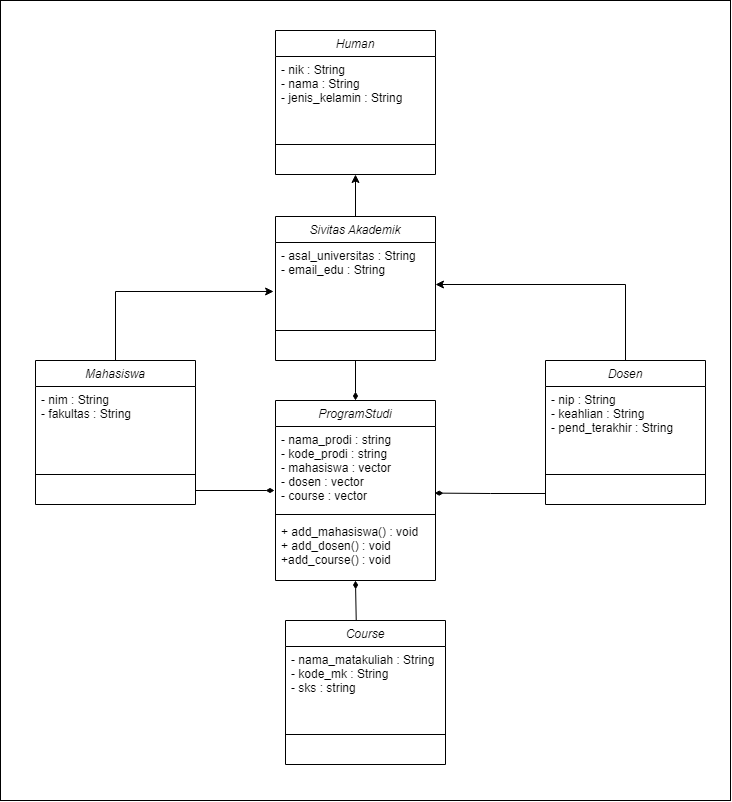
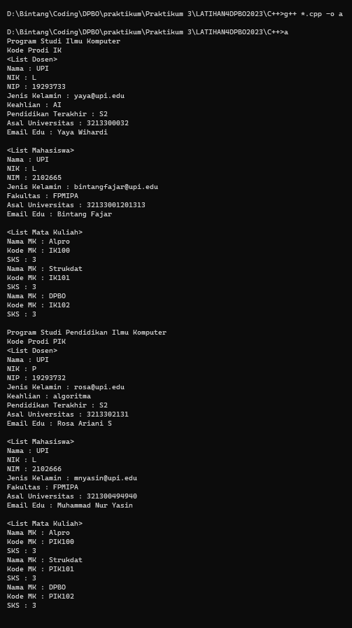

# OOP

# Janji
Saya Muhammad Cahyana Bintang Fajar NIM 2102665 mengerjakan Latihan 4 dalam mata kuliah Desain dan Pemrograman Berorientasi Objek untuk keberkahanNya maka saya tidak melakukan kecurangan seperti yang telah dispesifikasikan. Aamiin.

## Desain Program 
Terdiri dari 6 class yaitu **Human**, **SivitasAkademik**, **Mahasiswa**, **Dosen**, **ProgramStudi**, dan **Course**

#### Diagram

Didalam class **Human** memiliki 3 Atribut, yaitu : 
* Nama
* NIK
* Jenis Kelamin 

Didalam class **SivitasAkademik** memiliki 2 Atribut, yaitu : 
* Asal Universitas
* Email Edu

Didalam class **Mahasiswa** memiliki 2 Atribut, yaitu : 
* NIM
* Fakultas 

Didalam class **Dosen** memiliki 3 Atribut, yaitu : 
* NIP
* Keahlian
* Pendidikan Terakhir

Didalam class **Course** memiliki 3 Atribut, yaitu : 
* Nama Mata Kuliah
* Kode Mata Kuliah
* SKS

Didalam class **ProgramStudi** memiliki 5 Atribut, yaitu : 
* Nama Program Studi
* Kode Program Studi
* List Course
* List Dosen 
* List Mahasiswa

## Alur Program
### Relasi Antar kelas
* Disini Sivitas Akademik mengextend dari human dan nantinya mahasiswa dan dosen juga meng extend dari sivitas akademik, alasan saya adalah karena dosen dan mahasiswa adalah bagian dari sivitas akademik itu sendiri dan juga sivitas akademik tidak hanya mahasiswa dan dosen, bisa jadi pegawai TU juga,
* selanjutnya ada Program Studi, di dalam program studi dia composite ke 3 kelas yaitu mahasiswa, dosen dan juga course, alasannya adalah karena di setiap prodi itu pasti terdiri dari beberapa mahasiswa, dosen, dan juga course, untuk membuat hal itu terjadi, saya menambahkan method add course, add mhs dan add dosen, agar nantinya saya bisa memasukkan banyak mahasiswa ke dalam 1 programstudi, nantinya si program studi ini satu saja dan terdiri dari beberapa mahasiswa
### Cara Menjalankan Program
* sebelum dijalankan, perlu diketahui bahwa agar list dosen, mhs, dan coursenya tidak kosong, harus dibuat dulu itunya, baru di push ke prodi
* untuk menjalankan program python cukup run saja main nya, dan untuk menjalankan cpp, anda harus menjalankannya seperti menjalankan 3 file di Alpro, yaitu menyatukannya dalam satu direktori folder, setelah itu buka terminalnya, dan jalankan perintah **g++ *.cpp -o run&&run**

### Dokumentasi 

